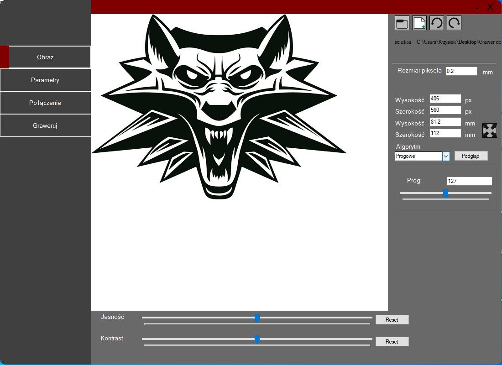
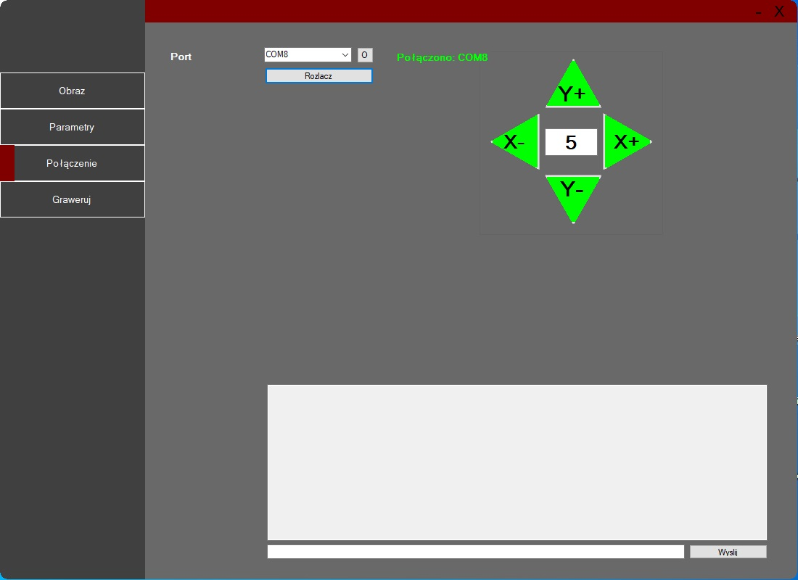
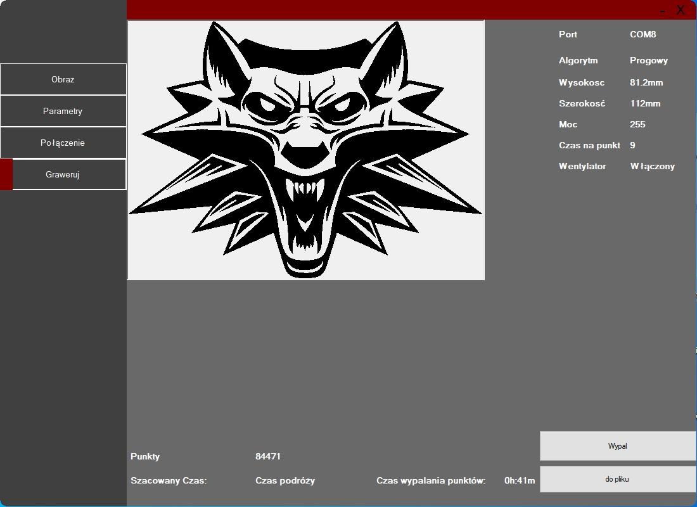

# Grawer
Oprogramowanie do generowania g-codu punktowego dla grawera laserowego. Do generowania punktów zostały wykorzytsane algorytmy: progowe,
stuckiego, Floyda-Steinberga

Oprogramowanie podzielone jest na 4 moduły:

-Obraz: Pozwala użytkownikowi na przygotownaie obrazu oraz wybór algorytmu do przetworzenia obrazu dla grawera(stucki, floyd-steinberg, progwy).

-Parametry: Pozwala użytkownikowi na wybór parametrów(moc, prędkość, czas na punkt, wntylator) oraz na tworzenie profili z paramterami.

-Połączenie: Pozwala na nawiązanie połączenia z urządzeniem oraz na jego sterowanie za pomocą konsoli i strzałek.

-Graweruj: Na podstawie wybranego zbioru punktów generuje g-code i przesyła go do urządzenia.

